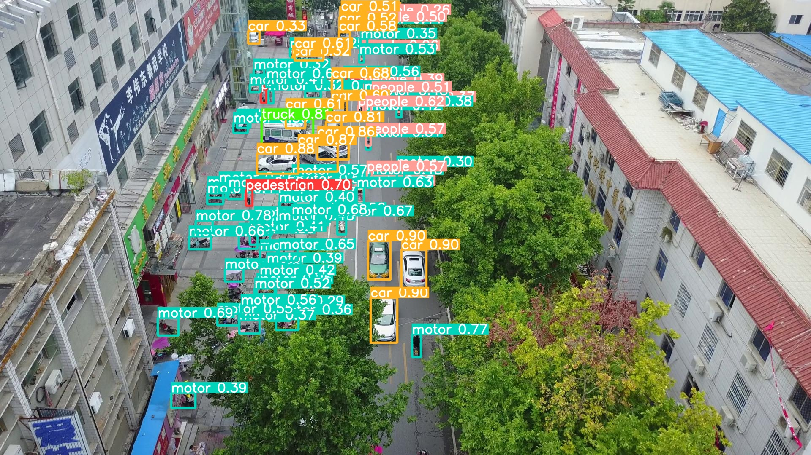

# HR-YOLOv9
 Based on PANet, we propose a feature extraction network that focuses on high resolution, applying it to YOLOv9 and achieving significant results.
 Additionally, we utilized SAHI technology in the inference stage of YOLOv9, resulting in an improvement in small object detection AP that surpasses any other model mentioned in the original paper.

## Performance 

VisDrone2019

| Model | Test Size | AP<sup>val</sup> | AP<sub>50</sub><sup>val</sup> | AP<sub>S</sub><sup>val</sup> | AP<sub>M</sub><sup>val</sup> | AP<sub>L</sub><sup>val</sup> |
| :-- | :-: | :-: | :-: | :-: | :-: | :-: |
| **YOLOv9-T** | 640 | **16.8%** | **29.1%** | **7.7%** | **20.7%** | **27.7%** |
| **YOLOv9-T(Ours)** | 640 | **19.3%** | **32.8%** | **10.0%** | **26.8%** | **37.2%** |
| **YOLOv9-S** | 640 | **20.5%** | **34.1%** | **9.7%** | **30.0%** | **48.7%** |
| **YOLOv9-S(Ours)** | 640 | **22.6%** | **37.7%** | **13.3%** | **30.3%** | **42.6%** |
| **YOLOv9-M** | 640 | **26.3%** | **42.9%** | **14.8%** | **36.5%** | **56.3%** |
| **YOLOv9-M(Ours)** | 640 | **28.6%** | **45.8%** | **18.1%** | **37.1%** | **53.8%** |
| **YOLOv9-C** | 640 | **27.0%** | **43.8%** | **15.8%** | **37.5%** | **54.7%** |
| [**YOLOv9-C(Ours)**](https://github.com/XYQDUT/HR-YOLOv9/releases/download/download/hr-yolov9c.pt) | 640 | **29.9%** | **47.7%** | **19.3%** | **38.5%** | **55.7%** |

## Useful Links

<details><summary> <b>Expand</b> </summary>

## Installation

``` shell
# pip install required packages
pip install requirements.txt

```

## Evaluation

[`hr-yolov9-c.pt`](https://github.com/XYQDUT/HR-YOLOv9/releases/download/download/hr-yolov9c.pt) 

``` shell
# evaluate yolov9 models
python val_dual.py --data data/visdrone2019.yaml --cfg models/hr-yolov9-c.yaml --img 640 --batch 32 --conf 0.001 --iou 0.7 --device 0 --weights './hr-yolov9-c.pt' --save-json --name hr_yolov9_c_c_640_val

# evaluate yolov9 models with SAHI
python val_dual_sahi.py --data data/visdrone2019.yaml --cfg models/hr-yolov9-c.yaml --img 640 --batch 32 --conf 0.001 --iou 0.7 --device 0 --weights './hr-yolov9-c.pt' --save-json --name hr_yolov9_c_c_640_val
```

## Training

Single GPU training

``` shell
# train yolov9 models
python train_dual.py --workers 8 --device 0 --batch 16 --data data/visdrone2019.yaml --img 640 --cfg models/hr-yolov9-c.yaml --weights '' --name hr-yolov9-c --hyp hyp.scratch-high.yaml --min-items 0 --epochs 100 --close-mosaic 15

```

Multiple GPU training

``` shell
# train yolov9 models
python -m torch.distributed.launch --nproc_per_node 8 --master_port 9527 train_dual.py --workers 8 --device 0,1,2,3,4,5,6,7 --sync-bn --batch 128 --data data/visdrone2019.yaml --img 640 --cfg models/hr-yolov9-c.yaml --weights '' --name hr-yolov9-c --hyp hyp.scratch-high.yaml --min-items 0 --epochs 100 --close-mosaic 15

```


## Inference

<div align="center">
    <a href="./">
        
    </a>
</div>

``` shell
# inference converted yolov9 models
python detect_dual.py --source './data/imgs' --img 640 --device 0 --weights './hr-yolov9-c.pt' --name hr-yolov9_c_c_640_detect

```

## Acknowledgements

<details><summary> <b>Expand</b> </summary>

* [https://github.com/WongKinYiu/yolov9](https://github.com/WongKinYiu/yolov9)
* [https://github.com/obss/sahi](https://github.com/obss/sahi)

</details>
